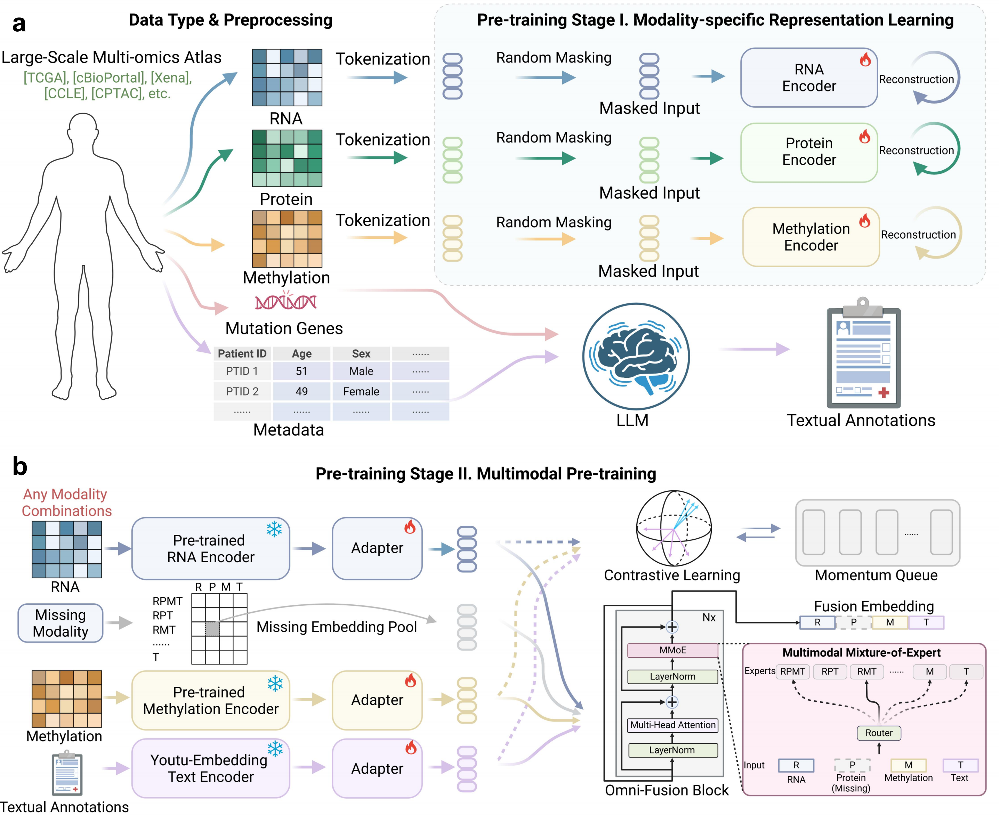

# O-MIX: Language-grounded multimodal foundation model for multi-omics integration

O-MIX is a language-grounded multimodal foundation model for learning unified representations from RNA, protein, DNA methylation, and LLM-generated textual annotations. The framework is designed for biomedical cohorts in which modalities are heterogeneous and frequently incomplete, and it combines large-scale unimodal pretraining with multimodal alignment under incomplete pairing.

Unlike task-specific multi-omics models trained from scratch for individual downstream applications, O-MIX adopts a two-stage pretraining strategy. In **Stage I**, modality-specific encoders are pretrained on large-scale unimodal omics datasets to capture within-modality biological structure. In **Stage II**, pretrained omics encoders are aligned with textual annotations through an Omni-Fusion block equipped with multimodal mixture-of-experts (MMoE) routing, enabling robust integration across arbitrary modality combinations.

The resulting representations support a broad range of downstream applications, including pan-cancer classification, prognosis modeling, drug response prediction, zero-shot cross-modal retrieval and classification, biomarker analysis, counterfactual therapy exploration, and retrieval-augmented clinical report generation.



---

## Highlights

- **Two-stage pretraining.** Stage I performs modality-specific self-supervised pretraining for RNA, protein, and methylation; Stage II performs multimodal alignment and fusion.
- **Flexible multimodal integration.** O-MIX accommodates arbitrary modality combinations through an Omni-Fusion block with MMoE routing.
- **Missing-modality robustness.** Missing inputs are modeled through a learnable embedding pool rather than explicit imputation.
- **Language-grounded representation learning.** Textual annotations synthesized from clinical metadata and mutations are aligned with omics data in a shared embedding space.
- **Generalist downstream utility.** The learned representations support prediction, retrieval, interpretation, and report generation.

---

## Supported applications

### 1. Representation learning and biological discovery
- Embedding clustering
- Zero-shot retrieval
- Zero-shot classification
- Biomarker analysis

### 2. Clinical predictive modeling
- Pan-cancer classification
- Prognosis prediction
- Drug response prediction

### 3. Language-grounded and generative applications
- Counterfactual therapy exploration

---

## Repository structure

```text
code/
├── pretrain/                # Stage I and Stage II pretraining scripts
├── finetune/                # Downstream predictive tasks
├── clustering/              # Embedding visualization and clustering analysis
├── crossmodal_retrieval/    # Cross-modal retrieval and zero-shot classification
├── biomarker_analysis/      # Feature attribution and biomarker discovery
├── data_preprocess/         # Metadata preprocessing & textual-annotation generation
└── omix/                    # Core library (models, tokenizer, training utilities)
```

Core model components:

```text
omix/model/model_uni.py      # Single-modality Performer encoder
omix/model/model_multi.py    # Multi-modality encoder
omix/model/omni_fusion.py    # Omni-Fusion block with MoE-based multimodal fusion
omix/Youtu_embedding/        # Text encoder for textual annotations
```

---

## Conda environments

This project uses two separate conda environments:

| Environment | Python | PyTorch | CUDA | Purpose | Requirements |
|-------------|--------|---------|------|---------|--------------|
| `omix` | 3.10 | 2.3.1+cu121 | 12.1 | Training & evaluation (all scripts except LLM-based annotation generation) | `requirements.txt` |
| `vllm` | 3.10 | 2.9.0+cu128 | 12.8 | vLLM server & textual annotation generation | `requirements_vllm.txt` |

### Install `omix` (training & evaluation)

```bash
conda create -n omix python=3.10
conda activate omix

# Option A: install from requirements
pip install -r requirements.txt

# Option B: manual install (core packages)
pip install torch==2.3.1 torchtext scanpy anndata wandb h5py peft
```

> **FastMoE** (required by `OmniFusionBlock`) is **not** installable via pip and must be built from source against your CUDA / NCCL versions. Please follow the official installation guide:
>
> [https://github.com/laekov/fastmoe/blob/master/doc/installation-guide.md](https://github.com/laekov/fastmoe/blob/master/doc/installation-guide.md)
>
> A minimal (non-distributed) build is typically:
>
> ```bash
> git clone https://github.com/laekov/fastmoe.git
> cd fastmoe && USE_NCCL=0 python setup.py install && cd ..
> ```

### Install `vllm` (textual annotation generation)

```bash
conda create -n vllm python=3.10
conda activate vllm

# Option A: install from requirements
pip install -r requirements_vllm.txt

# Option B: manual install (core packages)
pip install torch==2.9.0
pip install vllm openai transformers
```

Key versions: `torch==2.9.0+cu128`, `vllm==0.13.0`, `transformers==4.57.3`.

### Experiment tracking (WandB)

All pretraining/finetuning scripts use Weights & Biases for metric logging. Before launching training, log in (one-time):

```bash
export WANDB_API_KEY=<your_key>     # or run `wandb login` interactively
```

The scripts read `WANDB_API_KEY` from the environment; no key is hard-coded.

---

## Data acquisition

O-MIX uses public multi-omics resources for downstream evaluation, including pan-cancer cohorts (TCGA via GDAC Firehose), prognosis cohorts, **CCLE** drug response data, a human-diseases retrieval dataset, and a neoadjuvant breast cancer cohort. The Stage I/II **pretraining corpus** is described in the manuscript (*Methods* / *Data availability*) and is **not** distributed with this repository.

Raw and preprocessed evaluation data are **not bundled with this repository** (they exceed GitHub's size limits and have their own data-use agreements). Download the cohorts listed below and place them under the structure expected by the scripts:

```text
data/
├── GDAC/                              # TCGA per-cancer-type omics (ACC, BLCA, BRCA, ...)
├── CCLE2019/preprocessed/             # Drug response data
├── example_input/                     # Tiny samples bundled with the repo
│   ├── raw_metadata.csv               #   3 rows for the preprocessing demo
│   ├── protein_input.csv
│   ├── cpg_matrix.csv
│   └── textual_annotations_example.json   # 5 sample LLM outputs (format reference)
└── gene_name_mapping/                 # Reference vocabularies (gene/probe/protein)
```

A minimal `data/example_input/raw_metadata.csv` is included for the **Data preprocessing** demo below. Downstream cohorts (#8–#10) and pretrained weights (#1–#7) are listed in the tables below. For pretraining data sources and access policies, see the manuscript.

### Required external resources

The following files / weights are **not** shipped with this repository and must be obtained separately. Place each item at the **exact** local path shown below; the code uses these paths directly (no extra configuration needed).

#### A. Model weights

| # | Resource | Local destination | Download |
|---|---|---|---|
| 1 | **Youtu-Embedding** text encoder (drop the entire HF repo content into this folder) | `code/omix/Youtu_embedding/` | [tencent/Youtu-Embedding (HuggingFace)](https://huggingface.co/tencent/Youtu-Embedding/tree/main) |
| 2 | **DeepSeek-BFT** merged weights (for textual annotation generation, Step 2) | `code/pretrain/save/deepseek_bft/` | [model_weights/deepseek_bft](https://pan.baidu.com/s/11WrrtcoH4amozf8V0Xf55A?pwd=swqa) |
| 3 | Stage I — **RNA** pretrain bundle (`model_e15.pt` + `args.json` + `vocab_rna.json`) | `code/pretrain/save/rna_pretrain/` | [model_weights/rna_pretrain](https://pan.baidu.com/s/1tsLWBdHOwBKAjLtYcv90jg?pwd=fsmx) |
| 4 | Stage I — **Protein** pretrain bundle (`model_e5.pt` + `args.json` + `vocab_protein.json`) | `code/pretrain/save/protein_pretrain/` | [model_weights/protein_pretrain](https://pan.baidu.com/s/1r5OKUxSzNpcNzfAPdH6S7w?pwd=9kmu) |
| 5 | Stage I — **Methylation** pretrain bundle (`model_e40.pt` + `args.json` + `vocab_methyl.json`) | `code/pretrain/save/methylation_pretrain/` | [model_weights/methylation_pretrain](https://pan.baidu.com/s/1DuhI2j-RZFtaSmC3P28XAA?pwd=dnqg) |
| 6 | Stage II — **O-MIX-O** (omics-only) bundle (`model_e8.pt` + `args.json` + 3 × `vocab_*.json` + `pretraining_dataset_split.json`) | `code/pretrain/save/omix_o_pretrain/` | [model_weights/omix_o_pretrain](https://pan.baidu.com/s/1qf0nk2cEJfb8SG16nzoLzg?pwd=ywf3) |
| 7 | Stage II — **O-MIX-T** (omics + text) bundle (`model_e5.pt` + `args.json` + 3 × `vocab_*.json` + `pretraining_dataset_split.json`) | `code/pretrain/save/omix_t_pretrain/` | [model_weights/omix_t_pretrain](https://pan.baidu.com/s/1scUFJMg8gVnNOw0HvfpMmA?pwd=erc3) |

> Each pretrain bundle (#3–#7) is a **folder**, not a single file. Download the link, unzip if needed, and drop **the entire folder content** into the destination path shown above. The downstream scripts read `args.json` and `vocab_*.json` from the same directory as the `.pt` file.

> Per-script minimum download lists for downstream tasks are summarised in [§5 Downstream fine-tuning and Evaluation](#5-downstream-fine-tuning-and-evaluation) — you don't need to grab everything.

#### B. Datasets / cohorts

| # | Resource | Local destination | Download |
|---|---|---|---|
| 8 | **GDAC TCGA** pan-cancer cohorts (per cancer-type `mRNA_TPM.csv`, `methylation.csv`, `RPPA.csv`, clinical, mutations) | `data/GDAC/{ACC,BLCA,BRCA,...,UCEC}/` | [datasets/GDAC](https://pan.baidu.com/s/1RHjuMYqBSAcpar_gVysIMg?pwd=zc6m) |
| 9 | **CCLE** drug-response preprocessed cohort (RNA / methylation / protein / drug response) | `data/CCLE2019/preprocessed/` | [datasets/CCLE](https://pan.baidu.com/s/1vdu84U5Udg67u6p1nN_G7A?pwd=9f5n) |
| 10 | **Human-disease retrieval** dataset (cellwhisper) — `human_disease_tpm_log1p_filtered.h5ad`, `gsva.parquet`, etc. | `data/cellwhisper/human_disease/` | [datasets/human_disease](https://pan.baidu.com/s/1LV_V_zneIcJjrQVsCbLE_w?pwd=8tuf) |

---

## Pipeline overview

```
raw_metadata.csv
   │  preprocess_metadata.py            (omix env)
   ▼
preprocessed_metadata.json
   │  generate_textual_annotations.py   (vllm env, needs vLLM server)
   ▼
textual_annotations_{part}.json
   │  pretrain_OMIX_T.py / drug_response_prediction.py / ...
   ▼
(training / evaluation / retrieval)
```

All scripts use relative paths and expect to be launched from their own directory with `PYTHONPATH=../` (so `import omix` resolves).

---

## Quick start: which sections do I actually need?

We release **downstream evaluation cohorts** (#8–#10) and **pretrained checkpoints** (Stage I × 3 and Stage II × 2) in [§Required external resources](#required-external-resources). The pretraining corpus is not bundled here; see the manuscript. Most users do **not** need to rerun §§1–4.

| Your goal | Sections to follow |
|---|---|
| **Just run downstream fine-tuning / evaluation on our released cohorts** (disease classification, prognosis, drug response, retrieval, zero-shot, biomarker analysis) | Download the relevant rows from the resource tables above → jump straight to [§5 Downstream fine-tuning and Evaluation](#5-downstream-fine-tuning-and-evaluation) |
| **Run downstream fine-tuning on your own data** | §1 Data preprocessing → §2 Textual annotation generation (LLM) → §5 |
| **Pretrain Stage II on your own multimodal data** (re-using our Stage I encoders) | §1 → §2 → §4 |
| **Pretrain everything from scratch** on your own data | §1 → §2 → §3 → §4 → §5 |

In short: §§1–4 are only needed when you bring your own data; if you use our released cohorts, downloading the tables above is sufficient.

---

## 1. Data preprocessing

Before LLM-based textual-annotation generation, the raw clinical metadata CSV must be flattened into a per-sample JSON. This is done by `code/data_preprocess/preprocess_metadata.py`.

```bash
conda activate omix
cd code/data_preprocess
python preprocess_metadata.py
```

Input and output paths (configurable inside the script):

```text
Input:  data/example_input/raw_metadata.csv
Output: data/example_input/preprocessed_metadata.json
```

For each sample, the script concatenates all valid metadata columns into a single string of the form `"clinical text: KEY: VALUE; \n KEY: VALUE; ..."`. If mutation genes are available, you can manually append `"; \n gene mutations: GENE1, GENE2, ..."` per sample (see the example comment in the script). The resulting JSON is the input file consumed by the next step.

---

## 2. Textual annotation generation (LLM)

This step uses a fine-tuned LLaMA-3-70B (BFT — biomedical fine-tuning) served via **vLLM** to synthesize metadata and gene mutations into concise natural-language summaries. It requires the **`vllm`** conda environment.

### Step 2a — Launch the vLLM server (keep running in a dedicated terminal)

Replace `<LLAMA3_70B_BFT_DIR>` below with the absolute path to your **local LLaMA-3-70B + BFT fine-tuned (merged) weights directory**. The directory should contain the merged checkpoint plus a `chat_template.jinja` file (produced by LLaMA-Factory when you merge the BFT LoRA adapter into the base 70B weights).

```bash
conda activate vllm
CUDA_VISIBLE_DEVICES=0,1,2,3 python -m vllm.entrypoints.openai.api_server \
    --model <LLAMA3_70B_BFT_DIR> \
    --served-model-name bft \
    --port 8000 \
    --trust-remote-code \
    --max-model-len 16384 \
    --tensor-parallel-size 4 \
    --chat-template <LLAMA3_70B_BFT_DIR>/chat_template.jinja
```

> **Note**: Loading LLaMA-3-70B with `tensor-parallel-size=4` requires 4 GPUs with sufficient memory (~140 GB+ total). The server exposes an OpenAI-compatible API at `http://127.0.0.1:8000/v1`.

### Step 2b — Run textual annotation generation (in a separate terminal)

```bash
conda activate vllm
cd code/data_preprocess

# Default: processes indices 80000-120000 as part3
python generate_textual_annotations.py
```

The script connects to the local vLLM server, processes metadata from `data/example_input/preprocessed_metadata.json` (generated by `preprocess_metadata.py`), and saves textual annotations to `data/example_input/textual_annotations_{part}.json`. It supports checkpointing — interrupted runs can be resumed and will skip already-processed samples.

---

## 3. Stage I — Single-modality pretraining

Run from `code/pretrain/` with `PYTHONPATH=../`:

```bash
cd code/pretrain

# RNA pretraining (DDP, 4 GPUs)
PYTHONPATH=../ torchrun --nnodes=1 --nproc_per_node=4 pretrain_RNA.py

# Protein pretraining (single GPU)
PYTHONPATH=../ CUDA_VISIBLE_DEVICES=0 python pretrain_protein.py

# Methylation pretraining (DDP, 4 GPUs)
PYTHONPATH=../ torchrun --nnodes=1 --nproc_per_node=4 pretrain_Methylation.py
```

Checkpoints are saved to `code/pretrain/save/{rna,protein,methylation}_pretrain/`.

---

## 4. Stage II — Multimodal fusion pretraining

```bash
cd code/pretrain

# O-MIX-O: omics-only (RNA + Protein + Methylation)
PYTHONPATH=../ torchrun --nnodes=1 --nproc_per_node=4 pretrain_OMIX_O.py

# O-MIX-T: with textual annotations (RNA + Protein + Methylation + Text)
PYTHONPATH=../ torchrun --nnodes=1 --nproc_per_node=4 pretrain_OMIX_T.py
```

Checkpoints are saved to `code/pretrain/save/{omix_o,omix_t}_pretrain/`.

---

## 5. Downstream fine-tuning and Evaluation

If you only want to run the downstream tasks, this is the entry point. The table below tells you exactly which rows from [§Required external resources](#required-external-resources) you need to download for each script (you do **not** need to download everything).

| Script | Required resources |
|---|---|
| `clustering_visualization_RNA.py` | **#3** (RNA Stage I ckpt) + **#8** (GDAC) |
| `clustering_visualization_Protein.py` | **#4** (Protein Stage I ckpt) + **#8** |
| `clustering_visualization_methylation.py` | **#5** (Methylation Stage I ckpt) + **#8** |
| `clustering_visualization_OMIX_O.py` | **#6** (O-MIX-O ckpt) + **#8** |
| `disease_classification.py` | **#1** (Youtu-Embedding) + **#6** (O-MIX-O ckpt) + **#8** (GDAC) |
| `prognosis_prediction.py` | **#1** + **#6** + **#8** |
| `drug_response_prediction.py` | **#1** + **#7** (O-MIX-T ckpt) + **#9** (CCLE2019) |
| `pretraining_validation_retrival_stage1_save_embedding.py` / `stage2_evaluation.py` | **#1** + **#7** + pretraining-validation inputs (see manuscript; paths in `code/crossmodal_retrieval/`) |
| `humandisease_zeroshot_classification.py` | **#1** + **#7** + **#10** (cellwhisper) |
| `humandisease_retrieval_evaluation.py` | **#1** + **#7** + **#10** |
| `top100_genes_extraction_gradient.py` | **#1** + **#6** + **#8** |

### 5.1 Downstream fine-tuning

```bash
cd code/finetune

# Pan-cancer disease classification
PYTHONPATH=../ python disease_classification.py

# Prognosis (survival) prediction
PYTHONPATH=../ python prognosis_prediction.py

# Drug response prediction (CCLE2019)
PYTHONPATH=../ python drug_response_prediction.py
```

### 5.2 Clustering & representation visualization

```bash
cd code/clustering
PYTHONPATH=../ python clustering_visualization_RNA.py
PYTHONPATH=../ python clustering_visualization_OMIX_O.py
```

### 5.3 Cross-modal retrieval

```bash
cd code/crossmodal_retrieval

# Step 1: generate embeddings
PYTHONPATH=../ python pretraining_validation_retrival_stage1_save_embedding.py

# Step 2: evaluate retrieval
PYTHONPATH=../ python pretraining_validation_retrival_stage2_evaluation.py

# Zero-shot disease classification
PYTHONPATH=../ python humandisease_zeroshot_classification.py
```

### 5.4 Biomarker analysis

```bash
cd code/biomarker_analysis
PYTHONPATH=../ python top100_genes_extraction_gradient.py
```

---

## Cursor IDE skills (optional)

For users editing this repository in [Cursor IDE](https://www.cursor.com/), we ship a set of agent-assist Skills under `.cursor/skills/omix-multimodal/`. They let the Cursor agent guide you through the most common O-MIX workflows without having to re-read the source code each time — modality codes, sequence-length constants, checkpoint layout, the `PYTHONPATH=../` invocation rule, and the typical `KeyError` / `size mismatch` pitfalls are all encoded.

| File | Workflow |
|---|---|
| `SKILL.md` | Entry point — decision tree, repository orientation, key conventions, common-error quick-reference |
| `embedding.md` | Extracting patient-level embeddings from `omix_o_pretrain` / `omix_t_pretrain` |
| `finetune.md` | Three downstream fine-tunes: disease classification / prognosis / drug response |
| `retrieval.md` | Cross-modal retrieval, zero-shot disease classification, OMIM ↔ GSVA comparison |
| `clustering.md` | t-SNE / UMAP / Leiden clustering with ARI / NMI / silhouette metrics |
| `biomarker.md` | Gradient-based biomarker discovery (Integrated Gradients, top-K genes) |
| `pretraining.md` | Stage I & II retraining from scratch (DDP / `torchrun`) |

The Cursor agent loads these automatically when it sees relevant keywords (O-MIX, `OmniFusionBlock`, `model_e8.pt`, OMIM, GSVA, etc.). If you don't use Cursor, you can safely ignore `.cursor/`.

---

## License

This project is licensed under the Apache License 2.0.

Proteoformer is developed and maintained by **Tencent AI for Life Sciences Lab**. Copyright © 2026 Tencent AI for Life Sciences Lab. All rights reserved.

---

## Acknowledgements

O-MIX builds on large-scale public multi-omics resources (TCGA, cBioPortal, UCSC Xena, CCLE, CPTAC, ARCHS4, MethylGPT, TCPA, ArrayExpress) and pretrained language-model infrastructure (DeepSeek, vLLM, BGE-large) for textual annotation generation and retrieval-augmented interpretation. We thank the maintainers of these resources for making their data and tools openly available.
